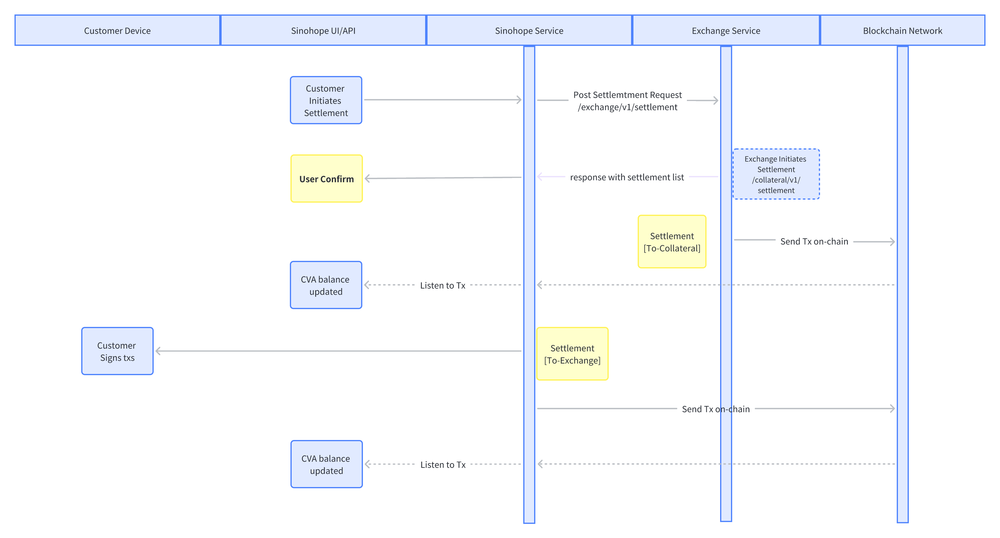
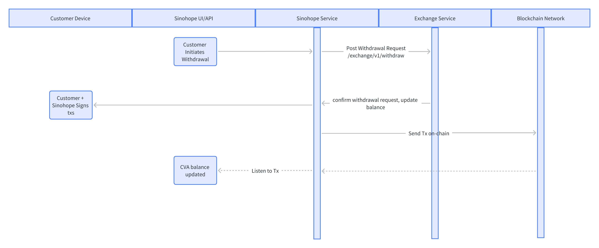

# Changelog

| Version | Log           | Date       | Modifier |
| ---- | ------------- | ---------- | ------ |
| v1.0.0 | first version | 2023-03-12 | Kevin  |
| v1.1.0 | second version| 2023-03-24 | Kevin  |

# Glossary

Roles: User U, Exchange E, Custody Platform C.

Main Exchange Account: Abbreviated as MEA. It is an account opened by User U on the exchange E, usually uniquely identified by an appkey.

Collateral Vault Account: Abbreviated as CVA. When User U needs to map assets to Exchange E, a CVA is created on Custody Platform C. CVA and MEA achieve a one-to-one mapping. The unique ID of CVA is collateralId.

# Main Steps

## Initiate

## Deposit

## Settlement

## Withdrawal

