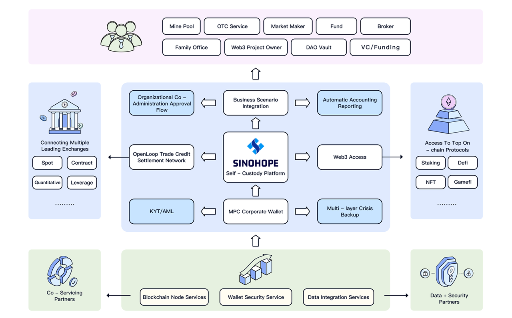

# MPC+AA is the Essential Path for Crypto Wallets to Achieve Mass Adoption with Over 1 Billion Users

Vitalik represents the core community of Ethereum, but the development of the Crypto industry needs more independent thinking and objective voices.

# Recap of the MPC and AA Debate

Recently, a major discussion on the direction of Crypto wallet technology has been reignited by negative comments made by Ethereum founder Vitalik Buterin about MPC EOA wallets. The debate was sparked by Vitalik's response to a community AMA question about MPC wallets, where he pointed out that MPC EOA wallets have a fundamental law that they "cannot revoke keys". 

This sparked much debate on Twitter, with key members of notable teams such as Coinbase, Zengo, and Slowmist participating.
This article won't repeat the principles and comparisons of MPC and AA (short for Account Abstraction, Ethereum's latest plan for smart contract wallet development). Those interested can refer to this article: [Seedless Self-Custody: On MPC and Smart Contract Wallets](https://medium.com/1kxnetwork/wallets-91c7c3457578) to understand. The core advantage of MPC is that it solves the single point problem of private keys, while AA's core advantage is its programmability.

After summarizing this discussion, the following conclusions can be drawn:

1. The Ethereum core community, represented by Vitalik, consistently thinks from a fully decentralized and full-onchain perspective. Therefore, their view on MPC wallets is understandable.
2. Although MPC keys can not be "cryptographically" revoked, this does not affect the security construction and large-scale application of MPC wallets.
3. Some in the community didn't understand the intent Vitalik was trying to express, while others were deliberately avoiding the presuppositions of decentralization that Vitalik implied.
4. It is encouraging to see some teams adopting a more open mindset, striving to promote the integration of MPC and AA, rather than just a battle of technical ideologies.
5. While there are many who are passionate about discussing technology, few truly care about user needs.

The largest regret in this whole discussion is the lack of consideration and analysis for the essential needs of users. In my opinion, technology is a means, and satisfying and surpassing user needs is the goal. Solving more user problems, rather than discussing technical philosophies, is the foundation for large-scale applications.

The purpose of this article is to make up for this shortcoming, focusing on the discussion of real user needs: scenarios, pain points, solutions, values, etc., with the hope of bringing some new perspectives and thoughts to this discussion.

# Demand for Crypto Wallets

I believe that the development of the Crypto industry in the next decade must achieve Mass Adoption and must provide services for users on the scale of billions.
Based on this vision, we need to solve two core issues: 1) Where do the users come from? 2) Where does the money come from?

The next wave of potential scale users are certainly not tech geeks who can't understand symmetric and asymmetric encryption technology and are likely unable to properly secure their own mnemonic phrases.

The next wave of potential scaled assets will likely come from the existing financial system's asset mapping, which will involve corporate users, who have vastly different needs and scenarios from individual users.

Below are two major types of user intent and their requirements/pain points in high-frequency scenarios:
| User Type        | User Willingness                                             | Example of Application Scenario      | Core Demand                                                  | User Pain Point                                              |
| ---------------- | ------------------------------------------------------------ | ------------------------------------ | ------------------------------------------------------------ | ------------------------------------------------------------ |
| Corporate Users  | Most have no desire to invest much in Crypto R&D resources Are more inclined to do efficient and simple service integration | Quantitative trading fund management | Asset security Rich and easy-to-use functionality Approval process/rule engine Regulatory license | Capital can't be lost Control of fund flow direction No need for teams to build their own wallets Hope for improvement in the inefficient cold wallet solution |
| Individual Users | Most hope to have the user experience of Web2  Being able to explore the innovative applications of Web3 | Web3 games                           | Asset security Easy to use                                   | Unwilling to take on too much encryption technology burden Hope for improvement in the anti-humanity of wallet mnemonic phrases Decentralized wallets can be integrated with a complete set of security solutions by default |

A widely accepted phrase in the Crypto industry is: "Not your keys, not your coins". From this, we can deduce that decentralized custody is crucial。

In fact, this kind of deduction doesn't take into account the actual user scenarios and implementation difficulties, it's essentially empty talk about decentralization. The a16z crypto column article "[Wallet Security: The ‘Non-Custodial’ Fallacy](https://a16zcrypto.com/posts/article/wallet-security-non-custodial-fallacy/)" analyzes and explains from the perspective of the generation, storage, and use of keys throughout their entire lifecycle, stating that custody and non-custody are not simply black and white.

In summary, according to our team's conclusions, the core needs of users can be summarized as the following triangle relationship:

This is almost an impossible triangle, and only by deeply combining user scenarios and core needs to make trade-offs can we achieve all three in the product.

# How to Satisfy the Above Requirements

Based on the description of user intentions and demands above, we can summarize users' needs in two sentences:

Users want asset security, but we cannot expect every user to have full-stack security knowledge and skills.

Users want control over their assets, not the need to personally control every aspect of product technology.

Having worked in the Crypto industry for many years, and as a senior user of new energy vehicles, I believe that there is a certain similarity between the current Crypto wallet industry and the new energy vehicle industry. To help readers understand, the following table compares the two industries, just for fun ^_^.

| Industry            | Existing Product                                             | So-called "Ultimate" Solution | User Migration Pain Points                                   | Best PMF                        |
| ------------------- | ------------------------------------------------------------ | ----------------------------- | ------------------------------------------------------------ | ------------------------------- |
| New Energy Vehicles | Traditional gasoline cars:  Not environmentally friendly* Lagging in intelligence Slow landing of autonomous driving | Pure electric                 | Pure electric cars have range anxiety Pure electric cars are expensive | Range-Extended Electric Vehicle |
| Crypto Wallets      | Single-signature wallets:  Poor security Inconvenient use   On-chain multisig:  Simple functionality Poor universality | AA Wallets                    | It takes years for AA wallets to truly land in the Ethereum ecosystem AA wallets are expensive to create and use It is expected that more than 60% of existing crypto assets will not be able to support AA wallets in the foreseeable future | ?

User needs are right in front of us, and the development of the industry should follow its objective laws. So, as entrepreneurs, how do we solve this problem and provide a product that meets or even exceeds user expectations?

We believe that, for the present and several years to come, the MPC wallet solution based on MPC-TSS + TEE Trusted Computing Technology has clear advantages in terms of security, multi-chain universality, usage cost, privacy, scalability, and other dimensions, making it the best PMF.

> This can be compared to the highly praised extended-range electric technology products on the Chinese new energy market, such as the Ideal Auto L Series.
We believe that the MPC wallet based on the above technology can meet the near-impossible triangle mentioned earlier:

At the same time, because an AA wallet needs one or more EOA addresses as controllers, and the single point problem of the private keys of EOA addresses can be well solved by MPC technology, we believe that MPC + AA is the ultimate solution.

# About Sinohope

Sinohope (https://www.sinohope.com/) is an MPC self-hosted platform under the New Huo Technology Holdings Limited (stock code: 1611.HK, “New Huo Tech”). The core team has managed the world's largest exchange asset custody system and has been responsible for developing several globally renowned high-performance blockchain technology platforms. The team is committed to creating a new generation of secure and compliant self-hosted platforms, allowing users to fully control and recover their private keys, ensuring the security of underlying assets while reducing user operation thresholds.

In the past six months, Sinohope has signed contracts with more than 100 B-side customers, and we welcome friends to cooperate in the following directions:
1. Exchanges, which can connect to our OpenLoop, increasing institutional customer trading volume, with currently signed customers having assets exceeding 5 billion USD
2. Market makers and trading funds, which do not need to deposit funds into centralized exchanges to trade mapped assets
3. OTC businesses
4. Companies holding digital assets that need multisig processes
5. Project parties or funds that need enterprise-level internal collaboration, approval, financial and taxation systems, etc.

The Sinohope product technology panorama is as follows. We welcome pioneers in the crypto industry to download, try, and give valuable suggestions: https://www.sinohope.com/zh-HK/download

# Conclusion

This article reviews the so-called debate between MPC and AA technologies. As authors, we analyze from the perspective of user needs and usage scenarios, combine user intentions and industry development directions, and see that the MPC wallet based on MPC-TSS + TEE Trusted Computing Technology is the best choice to match the market now and for a long period in the future. At the same time, we believe that MPC and AA are not antagonistic, but can be integrated and promote each other.

In our opinion, the rapid large-scale adoption of MPC wallets and their derivative services (such as waas) will help to solve the stubborn problem that has plagued the industry for many years - the single point failure problem brought about by the loss of private keys. It will help to solve the two core problems of the next wave of industry development: the sources of users and funds, and it will help to popularize blockchain technology to a user scale of 1 billion.

Most of the views in the article are from colleagues and peers, and the Sinohope product is built on the outstanding work of pioneers in the Crypto and MPC technology fields, for which we give thanks. Due to the limited knowledge of the author, there may be many errors in the text, and we welcome readers to correct them.

# References
Seedless Self-Custody: On MPC and Smart Contract Wallets：https://medium.com/1kxnetwork/wallets-91c7c3457578

Wallet Security: The ‘Non-Custodial’ Fallacy：https://a16zcrypto.com/posts/article/wallet-security-non-custodial-fallacy/

Record of Li Xiang's 2023 Spring Media Sharing Meeting: https://www.dongchedi.com/article/7206154196855489061

Blockchain Ecosystem TVL Comparison: https://coinmarketcap.com/charts/
