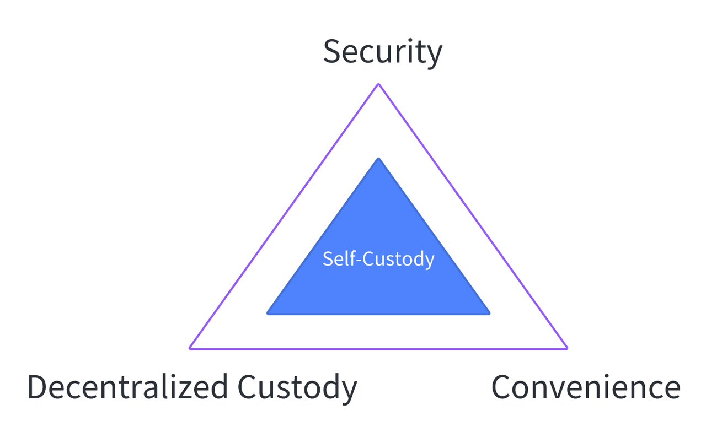

# MPC+AA 是 Crypto 钱包10亿级用户 Mass Adoption 必经之路

Vitalik 代表以太坊核心社区，但 Crypto 行业发展需要更多独立思考和客观声音

# MPC 与 AA 之争回顾总结

近期以太坊创始人 Vitalik  针对基于 MPC EOA 钱包负面评价再次引起了 Crypto 钱包技术路线之争的大讨论。
事件起因是 Vitalik 在回复网友 AMA 关于 MPC 钱包提问时，指出基于 MPC EOA 钱包存在「无法撤销密钥」这个基础性缺陷， 原文出处如下：

一石激起千层浪，此Twitter 引发诸多讨论，参与者包含 coinbase/zengo/slowmist 等知名团队核心成员。中文社区也掀起了一波「为 MPC 正名」运动，多个 MPC 钱包团队发表署名小作文回应 Vitalik 的言论。一时间，因为低迷市场行情而沉寂许久的 Crypto 社区，又吹起了久违的技术微风。LOL。

对于 MPC  和  AA （Account Abstraction 缩写，以太坊对于智能合约钱包发展的最新规划）钱包原理和对比，本文不再赘述，感兴趣可以参考 [Seedless Self-Custody: On MPC and Smart Contract Wallets](https://medium.com/1kxnetwork/wallets-91c7c3457578) 这篇文章进行理解：MPC 核心优势是解决了私钥单点问题，AA 的核心优势是一切可编程。

纵观本次讨论观点，做如下总结：
1）以Vitalik 为代表的以太坊核心社区，一贯只站在完全去中心化和全链上角度思考发展方向、规划社区路线、制定技术方案，对 MPC  钱包做出如此评价可以理解
2）MPC 密钥虽然无法实现「密码学上」撤销，但这并不影响 MPC 钱包安全性构建和大规模应用
3）社区小作文，部分没领会到 Vitalik 想表达的意图，部分是在刻意回避 Vitalik 隐含的去中心化等预设前提
4）可喜地看到了某些团队以更开放的心态，努力促进 MPC 和 AA 的融合，而不是单纯的技术理念之争
5）热衷讨论技术者众，真正关心用户需求者寡

整个讨论中，技术部分已经比较到位了，各战队都充分表达了本方的观点。然而，最大的遗憾，是讨论中缺少对用户本质需求的思考和分析。窃以为，技术是手段，满足和超越用户需求才是目的。多解决一些用户问题，少谈些技术理念和主义，才是大规模应用的前提和基础。

本文意图弥补上述遗憾，重点讨论用户真实需求：场景/痛点/方案/价值等，期望能为这一次讨论提供一些新角度和新思考。

# 钱包用户刚需
笔者以为，Crypto 行业未来十年的发展，一定要做到 Mass Adoption，一定要面向 10 亿级规模用户提供服务。
基于这样的愿景，我们要解决 2 个核心问题：1）用户从哪来  2）资金从哪来。
下一波潜在规模化用户，肯定不是技术极客/一般无法理解对称非对称加密技术/很可能无法妥善保管自己的助记词。
下一波潜在规模化资产，很可能是来源于现存金融体系里面的资产映射，这里面必然涉及企业用户，他们的场景以及诉求和普通用户又有着巨大的差异。
下面列举两大类用户意愿和他们在高频场景的需求/痛点：

| 用户类型 | 用户意愿                                                     | 应用场景举例     | 核心需求                                        | 用户痛点                                                     |
| -------- | ------------------------------------------------------------ | ---------------- | ----------------------------------------------- | ------------------------------------------------------------ |
| 企业用户 | 大部分没有意愿投入过多 Crypto 研发资源 更倾向于做高效简单服务集成 | 量化交易资金管理 | 资金安全 功能丰富易用：审批流/规则引擎 监管牌照 | 本金不能丢 资金流向可控 团队没必要自建钱包 冷钱包方案效率低下期望改进 |
| 个人用户 | 大部分期望能有web2用户体验 同时能探索web3应用创新            | Web3 游戏        | 资金安全 简单易用                               | 不愿意担负过多加密技术负担 期望钱包助记词的反人性能得到改进 去中心化钱包能默认集成全套安全解决方案 |

Crypto 行业广泛共识一句话：Not your keys, not  your coins。从这句话可以推论出：去中心化托管很重要。

实际上这种推论没有考虑真实用户的使用场景和实施难度，本质是空谈去中心化，a16z crypto 的专栏文章 [Wallet Security: The ‘Non-Custodial’ Fallacy](https://a16zcrypto.com/posts/article/wallet-security-non-custodial-fallacy/) 从密钥的产生/存储/使用全生命周期来分析说明，托管和非托管不是非黑即白。

综上所述，根据我们团队总结，用户核心需求可总结为如下三角关系：

这几乎是一个不可能三角，只有深入结合用户场景和核心需求做取舍，才能在产品上做到三者兼得。

# 如何满足上述需求

结合上述对用户意愿和诉求描述，用两句话可以总结出用户深层次需求：

**用户要的是资产安全性，但不能要求每个用户都有全栈安全知识和技能。**

**用户要的是资产控制权，而不是需要亲自控制整个产品技术全部环节。**

笔者从事 Crypto 行业多年，同时也是一位资深新能源汽车用户；笔者以为，当今 Crypto 钱包行业与新能源汽车行业有一定的相似性，为了帮助读者理解，下表对两个行业做一些对比，Just for fun。

| 行业       | 已有产品                                                     | 所谓的「终极」解决方案 | 用户迁移痛点                                                 | 最佳 PMF |
| ---------- | ------------------------------------------------------------ | ---------------------- | ------------------------------------------------------------ | -------- |
| 新能源汽车 | 传统燃油车:  不环保* 智能化落后 自动驾驶落地缓慢             | 纯电动                 | 纯电动车有里程焦虑 纯电动车价格偏高                          | 增程电动 |
| 加密钱包   | 单签钱包： 安全性差 使用不方便  链上多签： 功能简单 通用性差 | AA 钱包                | 在以太坊生态真正落地以年计数 AA 钱包创建和使用成本高 预计60%以上已有的加密资产所属的链，在可预见的未来无法支持 AA 钱包 | ？       |

用户的需求就摆在眼前，行业的发展要遵循其客观规律，那作为创业者，我们如何解决这个问题，提供满足甚至超越用户预期的产品？
我们认为，在当下和接下来若干年，基于 MPC-TSS + TEE 可信计算技术的  MPC  钱包解决方案，在安全性、多链通用性、使用成本、隐私性、扩展性等多个维度上，均有明显优势，是最佳的 PMF。

> 可以类比中国新能源市场上广受好评的基于增程电动技术产品，例如理想汽车 L 系列。

我们认为，基于上述技术的 MPC 钱包，可以满足前文所述的近似不可能三角：

与此同时，由于 AA 钱包需要一个或者多个EOA地址作为控制人，EOA 地址的私钥单点问题，可以由 MPC 技术很好地解决。因此，我们认为 MPC + AA 才是终极的解决方案。

# 关于 Sinohope

Sinohope(https://www.sinohope.com/)系新火科技控股有限公司（港股代码：1611.HK）旗下MPC自托管平台。核心团队曾管理全球最大交易所资产托管系统，也曾负责研发多个全球知名高性能区块链技术平台。团队致力于打造新一代安全合规自托管平台，让用户以 Web2 的体验做到完全控制、恢复私钥，在降低用户操作门槛的同时充分保证了底层资产安全。

近半年，Sinohope 平台已经签约B端客户100余家，欢迎各位朋友合作，合作方向如下：

1、交易所，可以接入我们的 OpenLoop，增加机构客户交易量，目前签约客户资金超50亿美元

2、做市商和 trading fund，不用把资金充值到中心化交易所即可映射资产进行交易

3、OTC商家

4、公司持有数字资产，需要多签流程

5、项目方或基金，需要企业级的内部协作、审批、财税系统等

Sinohope 产品技术全景图如下，欢迎 Crypto 行业先锋们下载试用并提出宝贵意见：https://www.sinohope.com/zh-HK/download

# 写在最后
本文回顾了所谓的 MPC 和 AA 技术之争。笔者从用户需求和使用场景去做分析，结合用户意愿和行业发展方向，看到了基于 MPC-TSS + TEE 可信计算技术的  MPC  钱包是当下以及未来很长一段周期内能够匹配市场的最佳选择，并带队构建出了行业 Tire1 级别的 Sinohope MPC 自托管产品。同时，笔者认为 MPC 和 AA 并不是对立，而是可以相互融合，相互促进的。

笔者认为，MPC 钱包以及其衍生服务（例如 WaaS）的快速大规模采用，将有助于解决困扰行业多年的顽疾——私钥丢失带来的单点失效问题，有助于解决行业下一个发展浪潮的两个核心问题：用户和资金的来源，有助于将区块链技术普及到 10 亿规模用户。

文中的大多数观点，都来自笔者同事和同行，Sinohope 产品也是构建在一众 Crypto 和 MPC 技术领域先驱的卓越工作之上，在此一并致谢。

限于笔者有限的见识，文中可能存在诸多纰漏，请读者不吝赐教。

# 引用文献
Seedless Self-Custody: On MPC and Smart Contract Wallets：https://medium.com/1kxnetwork/wallets-91c7c3457578

Wallet Security: The ‘Non-Custodial’ Fallacy：https://a16zcrypto.com/posts/article/wallet-security-non-custodial-fallacy/

理想汽车2023春季媒体分享会议记录：https://www.dongchedi.com/article/7206154196855489061
区块链生态 TVL对比：https://coinmarketcap.com/charts/
