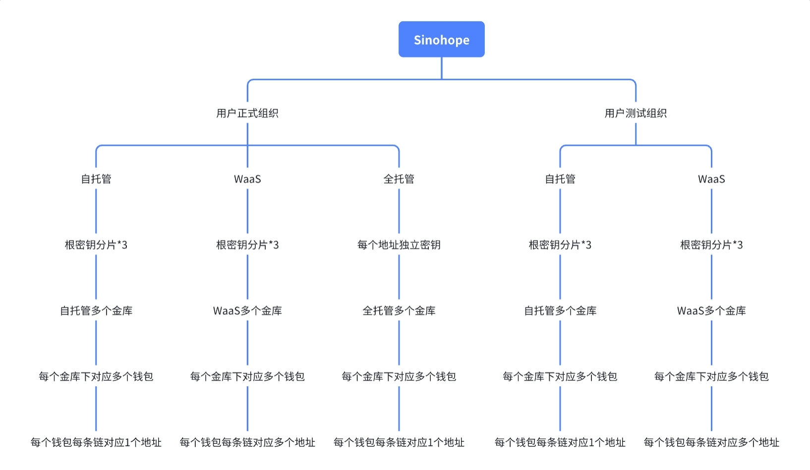

# Quick Start

本章节是一个快速使用教程，将帮助您快速了解并开始使用Sinohope提供的开发者服务。

客户在Sinohope开通账户时，将允许分别开通“测试组织” 和 “正式组织”，分别代表测试环境和正式使用环境。
测试环境只支持少量的测试链，供试用、集成测试等用途使用。本教程主要是在测试环境下使用。

本教程主要涉及以下事项：
- 开通并登录账户
- 组织和层级
- 基于API&SDK开发集成

### 开通并登录账户

要开始使用Sinohope 开发者服务，您需要联系[Sinohope](https://www.sinohope.com/)开通组织账户，之后在 [web console](https://console.sinohope.com/user/login) 界面基于邮箱注册您的个人账户并登录Sinohope为您开通的组织。

### 组织和层级

Sinohope 分为自托管钱包、WaaS钱包、全托管钱包。其中自托管钱包和WaaS钱包基于MPC-TSS技术提供服务，开发者可通过Open API集成相关功能。全托管钱包基于传统单私钥钱包提供中心化的托管服务。  

自托管和WaaS钱包，采用分层结构管理对应的链地址，分别包括四个层级。如下图示意：

### 基于API&SDK开发集成

Sinohope提供了基于HTTP协议的API，也将提供多种语言的SDK，方便开发者集成WaaS功能。SDK 主要提供以下功能：

- 统一封装接口请求签名处理；
- 封装API接口，方便开发者以方法调用的方式完成对API的请求。

当前提供的SDK：[java sdk](https://github.com/sinohope/sinohope-java-api)，[golang sdk](https://github.com/sinohope/golang-sdk)，[JS sdk](https://github.com/sinohope/js-sdk)。

# Docs Index
[General](/docs/develop/get-started/general)

[系统支持的公链及币种](/docs/develop/get-started/supported-coins)

[Open API](/docs/category/mpc-waas-api)

# Developer Group
