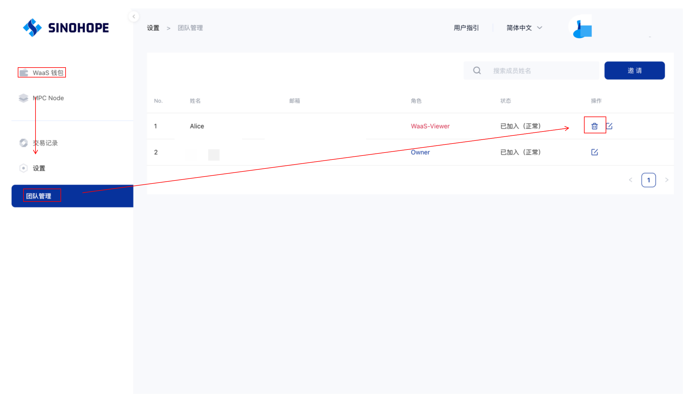

# ✈ 删除成员

在业务需要时,权限更高的团队成员可以删除更低权限等级的成员:

## （1）MPC钱包

1.登录到您的账户并进入成员管理组织页面。

2.在成员列表中，选择要删除的成员并点击右上角的删除按钮。

.png>)

3.连续点击两次操作确认并输入6位密码即可完成成员删除

.png>)

## （2）WaaS

WaaS删除成员目前仅支持Web端。登陆后依次点击【Waa S钱包】-【团队管理】-【删除图标】并完成验证即可删除成员。

